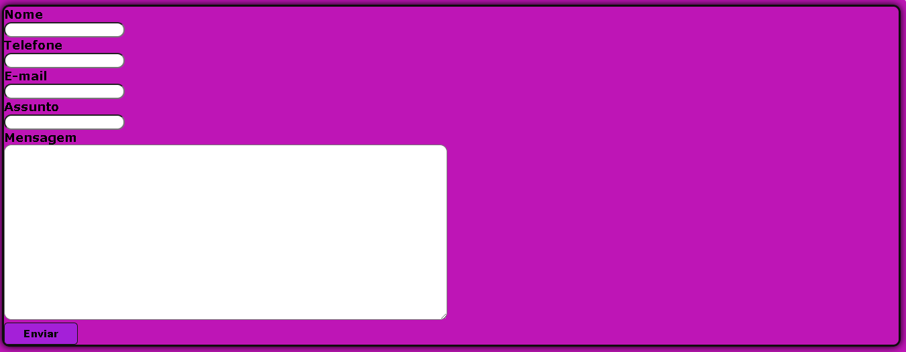

# form-contato
 
Esse projeto consciste na criação de projeto de formulario de contato.
## índice
* [Descrição](#descrição)
* [Tecnologias](#tecnologias)
* [Referência](#rêferências)
* [Autor(a)](#autora)
 
 
## Descrição
 
Esse projeto foi criado para uma página de formulario de contato.
 
## Resultado do projeto
 

 
## propriedades ultilizadas
 
 
* heigth - determina a altura da área do conteúdo de um elemento.
 
* background-color - ultilizado para colocar cor no projeto.
 
* font-family - ultilizado para escolher a fonte das letras.
 
* width -  determina a largura da área de conteúdo de um elemento. A área de conteúdo fica dentro do preenchimento, da borda, e da margem de um elemento.
 
* border-radius - deixa as bordas do container arredondadas.
 
* box-shadow -  adiciona efeitos de sombra ao redor do quadro de um elemento.
 
* border - define a borda de um elemento.f
 
* font-weight - define o peso (ou negrito) da fonte.
 
* color - define a cor do texto.
 
## elementos html ultilizados
 
* main - representa o conteúdo dominante do <corpo> de um documento.
 
* form - representa uma seção de documento que contém controles interativos para enviar informações.
 
* label - representa uma legenda para um item em uma interface do usuário.
 
* input -  ele é usado para criar controles interativos para formulários baseados na Web para aceitar dados do usuário; Uma ampla variedade de tipos de dados de entrada e widgets de controle estão disponíveis, dependendo do dispositivo e do agente do usuário.
 
* textarea -como se fosse um controle de edição de texto sem formatação de várias linhas, útil quando você deseja permitir que os usuários insiram uma quantidade considerável de texto de formato livre, por exemplo, um comentário em um formulário de revisão ou feedback.
 
* button - elemento interativo ativado por um usuário com um mouse, teclado, dedo, comando de voz ou outra tecnologia assistiva.
 
 
 
## Estilização
 
* O projeto foi estilizado ultilizando o arquivo main.css
 
```
body{
    background-color: rgb(190, 21, 182);
 
}
form{
    border: 3px solid rgb(14, 13, 13);
    color: rgb(0, 0, 0);
    font-family: Verdana,;
    border-radius: 10px;
    box-shadow: 0 0 10px black;
 
   
}
button{
    background-color: rgb(164, 32, 216);
    width: 100px;
    height: 30px;
    border: 1px solid rgb(20, 18, 18);
    color: rgb(8, 7, 8);
    font-weight: 900;
    border-radius: 5px;
   
}
#Container{
    border-radius: 10px;
    background-color: rgb(164, 32, 216);
    border: 2px solid rgb(20, 18, 18);
}
#largcoluna{
    font-weight: 900;

}
 ```

## Tecnologia
 
* HTML5
* CSS3
* GIT
* Github
* README
 
## Referências
[Mozilla](https://developer.mozilla.org/en-US/docs/Web/CSS/justify-content)
 
## Autor(a)
O projeto foi desenvolvido por:
 
* Kiara Messias
